# Cashback Registry

Cashback Registry contract records the user and cashback partner data on chain. User can pick one cashback partner for the next period. Partner can query the contract for eligible users that have selected them as partner, and distribute cashback reward to the users.

```mermaid
graph TD
   subgraph Timeline["📅 Period Timeline"]
        T1[Period X-1]
        T2[User Sets Partner<br/>for Period X]
        T3[Period X Starts]
        T4[Partner Queries Users<br/>from Period X-1]
        T5[Cashback Distribution<br/>in Period X]

        T1 --> T2
        T2 --> T3
        T3 --> T4
        T4 --> T5
    end

```

### User POV:

1. User log-in to their account (GnosisPay)

2. Select the partner from a list of registered cashback partner / use default cashback partner from the login-in app

3. When selected, call setPartnerForNextPeriod(address user, address partner) function on chain, where user is the GnosisPay address. This will emit the event PartnerRegisteredForPeriod(address indexed user, address indexed partner, uint256 indexed startTimestampOfPeriod).

4. User can change partner as many times they can within a period. Cashback partner for the period X is determined by the end of the period X-1.

### User POV in partner's app:

1. User log-in to their account (in partner X)

2. User click ${partner X} as default cashback partner

3. When selected, call setPartnerForNextPeriod(address user, address partner X) function on chain

## Edge case:

1. If user has multiple accounts for the same Pay account(i.e. GnosisPay, GnosisApp), the partner will be chosen after user has explicitly call setPartnerForNextPeriod on the partner app. Partner should query getPartnerAtPeriod(address user, uint96 period) for the latest partner from the user.

2. If partner is unregistered and user has not updated to new partner, querying getUsersAtPeriodForPartneror getPartnerAtPeriod will return the unregistered partner if last partner chosen by user is the unregistered partner. User has to explicitly update to a new registered partner from the list.

3. If user don't specify any partner, admin could set the first partner for user.

## Partner POV:

1. Partner should be whitelisted through admin. Admin will call registerPartner on chain to update their address.

2. Partner can be unregistered by admin through unregisterPartner.

3. To get eligible users for the cashback for period X:

   1. call getPeriod(timestamp in X)

   2. call getUsersAtPeriodForPartner(address[] memory user, address partner, uint96 period) returns address[] user

4. For example, partners K want to distribute cashback to eligible users at week Y, they need to know which partner the user chose at week Y-1 or before:

5. Partner calls getPeriod(timestamp in week Y-1) returns period OR getCurrentPeriod - 1 if query for last week

6. Partner calls getUsersAtPeriodForPartner(address[] user, address partner K, uint96 period ) returns (address[] users).

7. Partner proceeds with cashback distribution for users

**Event indexing**: Partners should be advised to listen for PartnerRegisteredForPeriod events for the user-{partner,startTimestamp} relationship.

## Admin Functionality

1. Can register partner and unregister partner

2. Can call setPartnerForNextPeriod on behalf of user, iff user has not set up the partner before. Calling this function will set the partner for the current period instead of the next period.

3. Immutable, will be a Safe account in production.

```mermaid
graph TD
subgraph Admin["👑 Admin Workflow"]
        A1[Admin Registers Partner]
        A2[registerPartner partner]
        A3{Partner Valid?}
        A4[Add to partnerList]
        A5[Emit NewPartnerRegistered]
        A6[Admin Unregisters Partner]
        A7[unregisterPartner partner]
        A8[Remove from partnerList]
        A9[Emit PartnerUnregistered]
        A10[Admin Sets Partner for User<br/>Current Period]
        A11[setPartnerForNextPeriod user, partner]
        A12[Set for Current Period]

        A1 --> A2
        A2 --> A3
        A3 -->|Yes| A4
        A4 --> A5
        A3 -->|No| AErr[Revert: InvalidPartner]

        A6 --> A7
        A7 --> A8
        A8 --> A9

        A10 --> A11
        A11 --> A12
    end
```

# Smart contract design

## Glossary:

1. Period: the period of cashback, the start and end timestamp of a period is determined by `[STAET*TIMESTAMP + PERIOD * DURATION, START*TIMESTAMP + (PERIOD+1) * DURATION)`.Within a period, user can choose for their partner for the next period.

2. Partner (address): the cashback partner, should be registered by admin

3. User (address): GnosisPay user who can choose for cashback partner.

## state variable

1. `mapping(address user ⇒ mapping(bytes32 head ⇒ bytes32 next)) partnerChangeLog`: A history of user's partner

2. `mapping(address partner ⇒ address nextPartner) partnerList`

3. `uint96 START_TIMESTAMP` : start timestamp of the first period

4. `uint96 DURATION`: duration of one period

5. `address ADMIN` : admin of the contract

## Event

1. `event PartnerRegisteredForPeriod(address indexed user, address indexed partner, uint256 indexed startTimestampOfPeriod);`

2. `event NewPartnerRegistered(address indexed partner);`

3. `event PartnerUnregistered(address indexed partner);`

## view function

1. `getPeriodAtTimestamp(uint256 timestamp) returns (uint96 period)`

`period = timestamp < START_TIMESTAMP ? 0 : (uint96(timestamp) - START_TIMESTAMP) / DURATION;`

2. `getCurrentPeriod() returns (uint96 period)`

`period = (block.timestamp - START_TIMESTAMP) / DURATION`

3. `getStartEndTimestampForPeriod(uint96 period) public view returns (uint256 startTimestamp, uint256 endTimestamp)`

4. `getPartnerAtPeriod(address user, uint96 period) returns (address partner)`: returns user's corresponding partner at period

5. `getPartnerAtPeriod(address[] memory user, uint96 period) returns (address[] partners)`

6. `isPartnerRegistered(address partner) view returns (bool)`

7. `getUsersAtPeriodForPartner(address[] memory user,address partner, uint96 period) returns(address[] users)`

## external function

1. `registerPartner(address partner) onlyAdmin`

   1. push to linked list

   2. set isPartnerRegistered as true

   3. emit NewPartnerRegistered

2. `unregisterPartner(address partner)`

   1. remove from linked list and set isPartnerRegistered to false

   2. emit PartnerUnregistered

3. `setPartnerForNextPeriod(address user, address partner) returns (uint256 nextStartTimestamp` : Main function to update partner for user

   1. Add the {partner+startPeriod} into partnerChangeLog linked list

   2. Case 1: Called by user to register their first partner: Partner will be taken affect starting from next Period
   3. Case 2: Called by admin to register user's first partner: Partner will be taken affect starting from the current period:
   4. Case 3: If user has already chosen the partner for next period, but want to switch to a different partner: The head of the partnerChangeLog linked list is updated
   5. Case 4: User wants to update their partner for the next period: Add new partnerWithPeriod node into the partnerChangeLog linked list

## Workflow

The workflow between User, Admin and Partner is shown in the graph below:

