# Cashback Registry

Cashback Registry contract records the user and cashback partner data on chain. User can pick one cashback partner for the next period. Partner can query the contract for eligible users that have selected them as partner, and distribute cashback reward to the users.

```mermaid
graph TD
   subgraph Timeline["📅 Period Timeline"]
        T1[Period X-1]
        T2[User Sets Partner<br/>for Period X]
        T3[Period X Starts]
        T4[Partner Queries Users<br/>from Period X-1]
        T5[Cashback Distribution<br/>in Period X]

        T1 --> T2
        T2 --> T3
        T3 --> T4
        T4 --> T5
    end

```

### User POV:

1. User log-in to their account (GnosisPay)

2. Select the partner from a list of registered cashback partner / use default cashback partner from the login-in app

3. When selected, call `setPartnerForNextPeriod(address user, address partner)` function on chain, where user is the GnosisPay address. This will emit the event `PartnerRegisteredForPeriod(address indexed user, address indexed partner, uint256 indexed startTimestampOfPeriod)`.

4. User can change partner as many times they can within a period. Cashback partner for the period X is determined by the end of the period X-1.

### User POV in partner's app:

1. User log-in to their account (in partner X)

2. User click ${partner X} as default cashback partner

3. When selected, call `setPartnerForNextPeriod(address user, address partner X)` function on chain

## Edge case:

1. If user don't specify any partner, admin could set the default partner for user.

2. If user uses multiple partner apps with the same Pay account(i.e. GnosisPay, GnosisApp), the partner will be chosen after user has explicitly call setPartnerForNextPeriod on the partner app. Partner should query getPartnerAtPeriod(address user, uint96 period) for the latest partner from the user, or index PartnerRegisteredForPeriod event.

3. If partner is unregistered and user has not updated to new partner, querying `getUsersAtPeriodForPartneror` `getPartnerAtPeriod` will return the unregistered partner if last partner chosen by user is the unregistered partner. User has to explicitly update to a new registered partner from the list.

## Partner POV:

1. Partner should be whitelisted through admin. Admin will call `registerPartner` function on chain to update their address.

2. Partner can be unregistered by admin through `unregisterPartner` function.

3. To get eligible users for the cashback for period X:

   1. call `getPeriod(timestamp in X)`

   2. call `getUsersAtPeriodForPartner(address[] memory user, address partner, uint96 period) returns (address[] user)`

4. For example, partners K want to distribute cashback to eligible users at week Y, they need to know which partner the user chose at week Y-1 or before:

5. Partner calls `getPeriod(timestamp in week Y-1)` returns period OR `getCurrentPeriod` - 1 if query for last week

6. Partner calls `getUsersAtPeriodForPartner(address[] user, address partner K, uint96 period ) returns (address[] users)`.

7. Partner proceeds with cashback distribution for users

**Event indexing**: Partners should be advised to listen for `PartnerRegisteredForPeriod` events for the user-{partner,startTimestamp} relationship.

## Admin Functionality

1. Can register partner and unregister partner

2. Can call setPartnerForNextPeriod on behalf of user, iff user has not set up the partner before. Calling this function will set the partner for the current period instead of the next period.

3. Immutable, will be a Safe account in production.

# Smart contract design

## Glossary:

1.  **Period**: A time interval for cashback calculations. A period is defined by a `startTimestamp` and `endTimestamp`. Users select partners for the _next_ period.
2.  **Partner (address)**: A cashback partner, which must be registered by the admin.
3.  **User (address)**: A user who can select a cashback partner.

## State Variables

- `startTimestamp`: `uint96` - The timestamp when the current set of periods began.
- `duration`: `uint96` - The duration of each period in seconds.
- `ADMIN`: `address` - The administrator of the contract.
- `partnerChangeLog`: `mapping(address user => mapping(bytes32 => bytes32))` - A linked list for each user, storing their history of partner selections. The key `bytes32` packs the partner address and the start timestamp of the period.
- `partnerList`: `mapping(address partner => address nextPartner)` - A linked list of registered partners.
- `lastDurationBeforeDurationChange`: `uint96` - Stores the previous duration when `setDuration` is called.
- `lastStartTimestampBeforeDurationChange`: `uint96` - Stores the previous start timestamp when `setDuration` is called.

## Events

- `event PartnerRegisteredForPeriod(address indexed user, address indexed partner, uint256 indexed startTimestampOfPeriod);`
- `event NewPartnerRegistered(address indexed partner);`
- `event PartnerUnregistered(address indexed partner);`
- `event DurationUpdated(uint96 indexed newDuration, uint96 indexed oldDuration);`

## View Functions

- `getPeriodAtTimestamp(uint96 timestamp) returns (uint256 _startTimestamp, uint256 _endTimestamp)`: Returns the start and end timestamp of the period for a given timestamp.
- `getCurrentPeriod() returns (uint256 _startTimestamp, uint256 _endTimestamp)`: Returns the start and end timestamp of the current period.
- `getPartnerAtTimestamp(address user, uint96 timestamp) returns (address partner)`: Returns a user's partner at a specific timestamp.
- `getPartnerAtTimestamp(address[] memory user, uint96 timestamp) returns (address[] partners)`: Returns partners for multiple users at a specific timestamp.
- `isPartnerRegistered(address partner) view returns (bool)`: Checks if a partner is registered.
- `getUsersAtTimestampForPartner(address[] memory user, address partner, uint96 timestamp) returns (address[] users)`: Filters a list of users to find those associated with a specific partner at a given timestamp.

## External Functions

- `registerPartner(address partner) onlyAdmin`: Registers a new partner.
- `unregisterPartner(address partner) onlyAdmin`: Unregisters an existing partner.
- `setPartnerForNextPeriod(address user, address partner) returns (uint256 nextStartTimestamp)`: Allows a user or admin to set the partner for a future period.
- `setDuration(uint96 _duration) onlyAdmin`: Updates the duration of periods.

## Workflow

The workflow between User, Admin and Partner is shown in the graph below:

