# Cashback Registry

Cashback Registry contract records the user and cashback partner data on chain. User can pick one cashback partner for the next period. Partner can query the contract for eligible users that have selected them as partner, and distribute cashback reward to the users.

```mermaid
graph TD
   subgraph Timeline["📅 Period Timeline"]
        T1[Period X-1]
        T2[User Sets Partner<br/>for Period X]
        T3[Period X Starts]
        T4[Partner Queries Users<br/>from Period X-1]
        T5[Cashback Distribution<br/>in Period X]

        T1 --> T2
        T2 --> T3
        T3 --> T4
        T4 --> T5
    end

```

## Smart contract design

User-Partner relationship is tied to each period, where user can update their cashback partner for period X+1 by the end of period X. Each period is determined by `[START_TIMESTAMP + (PERIOD X)*DURATION, START_TIMESTAMP + (PERIOD X+1)*DURATION)`

The workflow between User, Admin and Partner is shown in the graph below:

